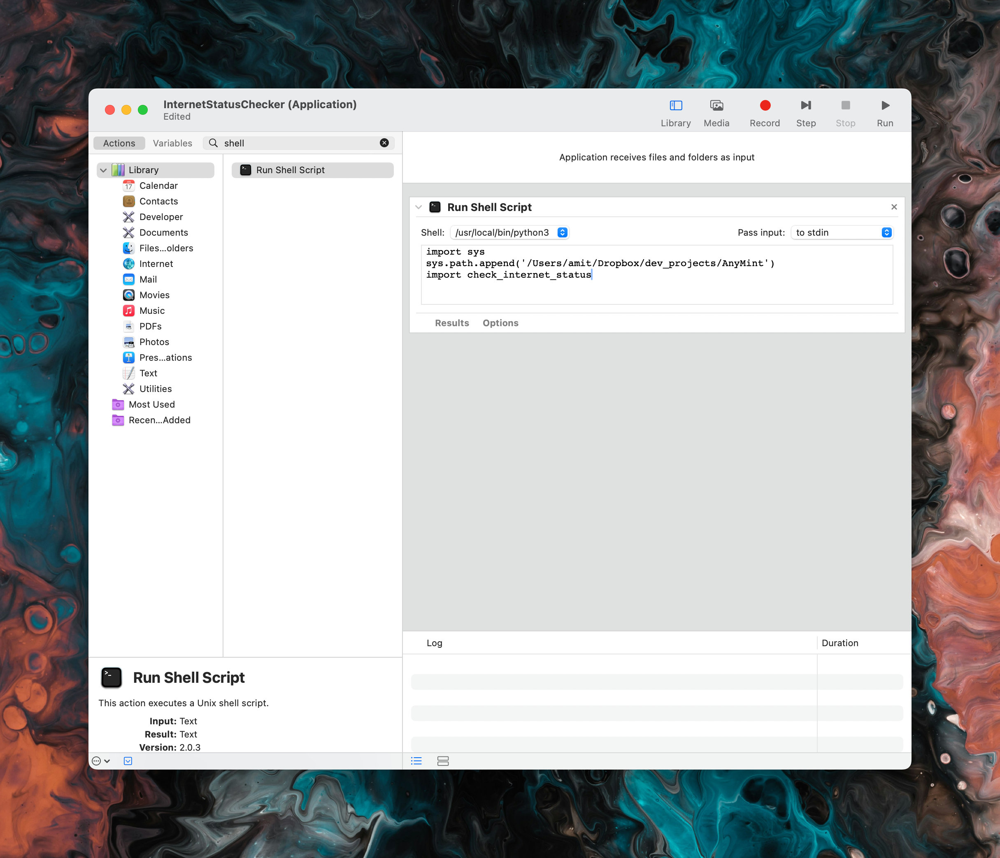

# AnyMint - Internet Status Checker for Mac
The WiFi indicator on the menubar can be misleading. Even though it says you're connected to WiFi, it doesn't always mean you're connected to the internet. This is especially true when on train/flight/hotel WiFi.

**AnyMint** continuously monitors your internet connection by sending a request to Google and visually displays the status using the AnyBar application. It changes the AnyBar icon to green when the connection is successful, showing the response time, and to red when there's a timeout.


AnyMint is built on top of [AnyBar](https://github.com/tonsky/AnyBar) - a tiny Mac app that does one simple thing: it displays a colored dot on the menubar. What the dot means and when to change it is up to you.

## Setup AnyMint

1. Install AnyBar
   ```
   brew install --cask anybar
   ```

2. Clone this repo
   ```
   git clone https://github.com/ajot/AnyMint.git
   ```

## Requirements

- Python 3
- AnyBar application
- `pyanybar` Python library
- `requests` Python library

## Installation

1. Create a virtual environment:
   ```
   python3 -m venv venv
   ```

2. Activate the virtual environment:
   ```
   source venv/bin/activate
   ```

3. Install the required Python libraries:
   ```
   pip install pyanybar requests
   ```

4. Install the AnyBar application (if not already installed):
   ```
   brew install --cask anybar
   ```

## Usage

To run the script manually:

```
python check-internet-status.py
```

## Automatic Startup (macOS)

To have the script run automatically at login:

1. Open Automator and create a new Application.
2. Add a "Run Shell Script" action.
3. Set the shell to `/usr/bin/python3`.
4. Paste the script content or call the script file, ensuring you activate the virtual environment first:
   ```
   source /path/to/your/venv/bin/activate
   python /path/to/your/check-internet-status.py
   ```
5. Save the Automator application.
6. Add the Automator application to your Login Items in System Preferences > Users & Groups.



## Configuration

- The script is set to send a request to Google (`http://www.google.com`) by default. You can change this in the `check_internet_connection` function.
- The AnyBar port is set to 1738. Modify the `port` variable if needed.
- The script checks the connection every 5 seconds. Adjust the `sleep(5)` line to change this interval.

## Troubleshooting

- Ensure AnyBar is running before starting the script.
- Check that the AnyBar port matches in both the application and the script.
- For issues with Python libraries, ensure they are correctly installed in your virtual environment.
- If using the Automator method for automatic startup, make sure the paths to your virtual environment and script are correct.

## Acknowledgments

- AnyBar project: https://github.com/tonsky/AnyBar
- pyanybar library
- requests library